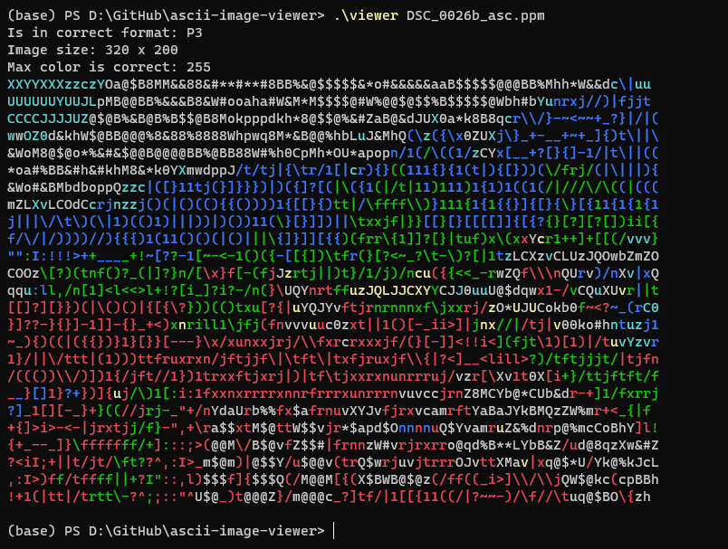
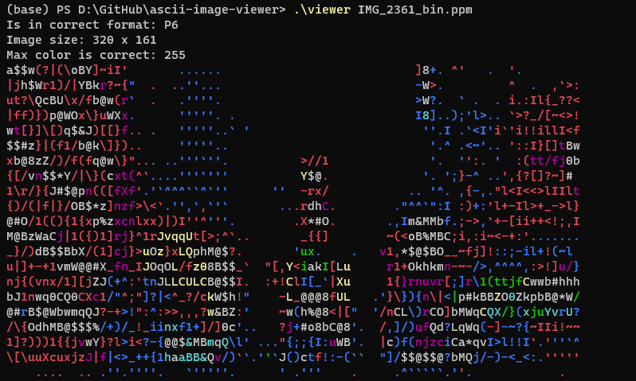
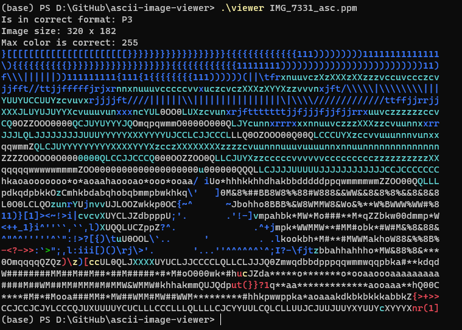

# ASCII Image Viewer

An image viewer that takes in PPM formatted files and views the image as colored ASCII characters. Created with C, the application will read images in Portable Pixmap Format (PPM) of both ASCII and binary encoding and read in the pixels. These pixels will then be used to determine the luminosity and color to print out. The result of this should display the image rendered as colored ASCII values. But with the terminal, the rendered pixels is limited by the size of the terminal. Downsizing is necessary in order to accommodate for the character cap.

## Project Samples

**Image 1**
 

**Image 2**
 

**Image 3**
 

## Launching the Application

In the command prompt, locate the project directory and run the `viewer.exe` file with an additional argument of the file that is to be previewed.\
Example: `.\viewer.exe DSC_0026b_asc.ppm`
